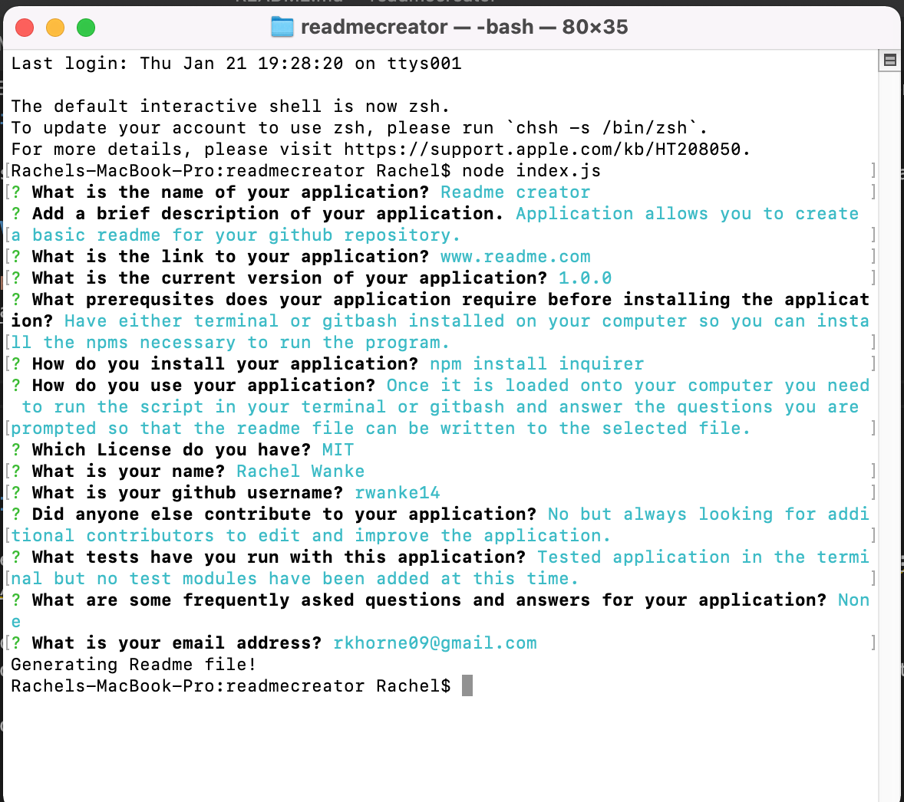

# Title README Generator

## About the application:

This application is a simple readme generator that uses modularization to create a basic readme file. When you run the index.js file in the terminal you are prompted with a series of questions that will then be written into the readme-sample.md file. The files are modulized with the index.js being the main file and the markdown file feeds into it. This application uses the inquirer npm and methods native to node.js. 

## Video Walkthrough of Application:

### Screenshots:

## Important Resources used:

Referenced a github overview of how to set up your markdown for a readme file: https://guides.github.com/features/mastering-markdown/.

Also worked with my study group to better understand how to apply what we learned in class to this readme. Note: Some code may look similar since we generally come out these thing in the same ways.

Feedback, brainstorming, and general support to study group:

        1. Young Ji Kim - https://github.com/youjmi
        2. Amir Ashtiany - https://github.com/Alexfit4
        3. Johnnie Simpson - https://github.com/balokdecoy
        5. Frankie Rosado - https://github.com/Franciscorosado09